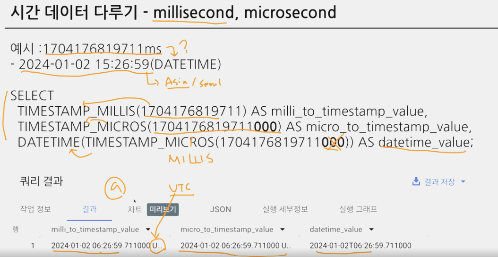
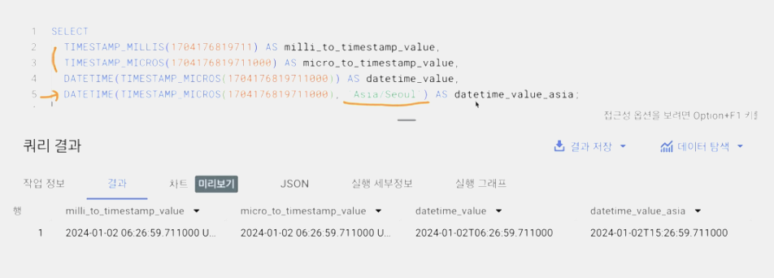
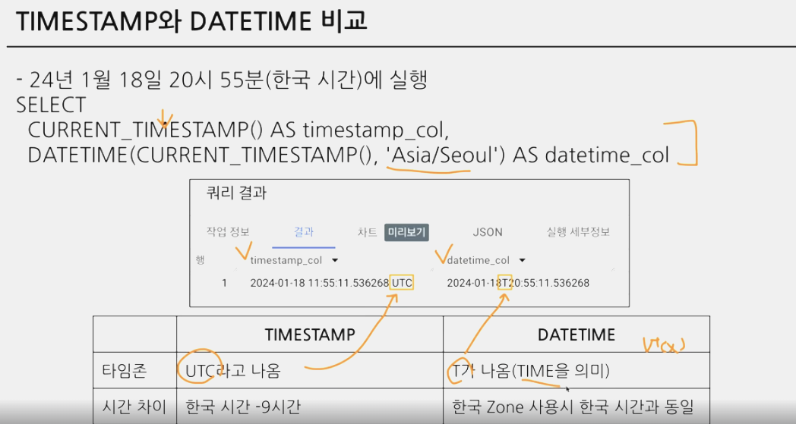

## 3-2. 오류 디버깅 방법

* syntax error (문법 오류)
   -> 오류 메세지 읽고 해석
   -> 구글링/공식 문서/ChatGPT
- SELECT list must not be empty at [10:1]
- Number of arguments does not match for aggregate function COUNT (집계 함수 COUNT의 인자 수가 일치하지 않습니다) <br/>
  COUNT 함수에는 1개만 들어갈 수 있음!!!
- Syntax error : Expected end of input but got keyword SELECT (입력이 끝날 것으로 예상되었지만 SELECT 키워드가 입력되었습니다) <br/>
  SELECT 근처 확인하기, 하나의 쿼리엔 SELECT가 1개만 있어야 함!!! <br/>
  혹은 쿼리가 끝나는 부분에 ; 붙이고 실행할 부분만 드래그 앤 드랍해서 실행하기

-------
# 4. 데이터 탐색 - 변환

## 4-1. 


## 4-2. 
- 데이터 타입 
<br/>

- WHERE 조건절은 조건 = TRUE인 경우를 전제로 진행됨
- 엑셀에서 보이는 것과 실제로 데이터가 저장된 것에 차이가 존재할 수 있음! 내 생각과 다른 경우 데이터의 타입을 서로 변경해야함

### 자료 타입 변경 함수 : CAST
SELECT
    CAST(1 AS STRING)  #숫자 1을 문자 1로 변경

> WHAT IF ...
SELECT
    CAST("카일스쿨" AS INT64)
=> 문자열은 숫자로 변경할 수 없기 때문에 오류 뜸<br/>


### 이럴 때 더 안전하게 데이터 타입 변경하는 법 : SAFE_CAST
- SAFE_가 붙은 함수는 변환이 실패할 경우 NULL 반환
<br/>

### 수학 함수
- 수학 연산(평균, 표준편차, 코사인 등)이 존재

```
TIP. 나누기할 때 x/y 대신 SAFE_DIVIDE 함수 사용하기
         x/y 쓰면 x, y 중 하나라도 0인 경우 그냥 나누면 zero error 발생 => SAFE_DIVIDE 함수 써서 NULL 값으로 나오게 하기
    EX. SAFE_DIVIDE(x,y)
```

-------
## 4-3. 문자열 함수


- **CONCAT**
<br/>


- **SPLIT**
    - SPLIT(문자열 원본, 나눌 기준이 되는 문자)
    - 결과가 '배열(ARRAY type)'로 나옴.

    

```
ARRAY type
    - 여러 가지 데이터를 저장할 수 있는 자료 구조 
    - 사진처럼 1개의 행에 여러 개의 값이 저장되어 있으면 배열이구나~ 생각하면 됨(<-> 배열 아니면 1개의 행에 1개의 값, '나'는 행 2에, '다'는 행 3에... 이런식으로 저장되어 있을 것)
```


- **REPLACE**
    - REPLACE(문자열 원본, 찾을 단어, 바꿀 단어)
    

- **TRIM**
    - TRIM(문자열 원본, 자를 단어)
    <br/>

    

- **UPPER**
    - UPPER(문자열 원본)
    

----
## 4-4. 날짜 및 시간 데이터
- **핵심**

- 유저가 행위를 했다 -> 시간 데이터가 붙음
    - 일반적인 시간과 개발 시간이 다르기 때문에 알아야함
    <br/>

### **시간 데이터 다루기**
- 세부적으로 나누면 **DATE, DATETIME, TIMESTAMP 등**
    1. DATE : **DATE만** 표시하는 데이터 (시간/분초 X)
        EX. 2023-12-31
    2. DATETIME : **DATE와 TIME까지** 표시, TIMEZONE 정보 X
        EX. 2023-12-31 14:00:00
    3. TIME : **시간만** 표시하는 데이터, 날짜 X
        EX. 14:00:00
<br/>

- **TIMEZONE** ***중요!!!
    1. GMT  : Greewich Mean Time
    2. UTC : 국제적인 표준 시간 (한국 시간 : UTC+9) -> 요즘에 많이 활용
<br/>

> 타임존이 존재한다 = 특정 지역의 표준 시간대

- **TIMESTAMP**
    - UTC부터 경과한 시간을 나타내는 값

- **millisecond, microsecond**
    - **millisecond(ms)**
        - 시간의 단위, 천 분의 1초 (1000ms = 1초)
        - 우리가 아는 초보다 더 짧은 시간 단위
        - 빠른 반응이 필요한 분야에서 사용 (초 단위보다 더 정밀한게 필요할 때)
            - millisecond -> timestamp -> datetime 순으로 변경해서 사용
        
- **microsecond(μs)**
    - 1/1,000ms
    
    
```
이 쿼리는 잘못 짠 쿼리ㅠ.ㅠ
Timestamp 쓸 때는 반드시 타임존을 넣어서 쓰자
(특정 지역의 표준 시간대를 고려하자! 아니면 시차 때문에 오차 생길 수 있음)
```

```
이렇게 써야된다.
Timestamp -> Datetime 변환할 때 타임존을 고려해서 datetime_value_asia 이런식으로 써줘야 타임존에 맞게 올바른 시간 데이터 얻을 수 있음
```

- **TIMESTAMP와 DATETIME 비교**
    - CURRENT_TIMESTAMP 함수 : 현재 TIMESTAMP를 알려줌
    <br/>

    
        