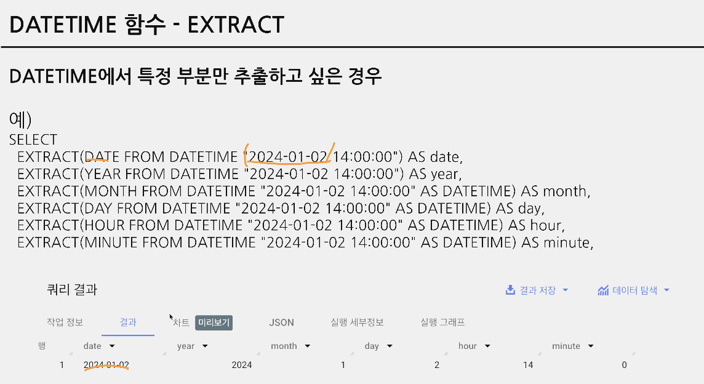
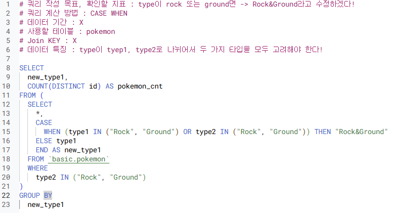

## 4-4. 날짜 및 시간 데이터 (2)
- CURRENT_DATETIME([time_zone]) : 현재 DATETIME 출력
    -  timezone을 "Asia/Seoul" 이런식으로 넣어줘야! 명시 안하면 결과에 시간 차이 생김

- DATETIME에서 특정 부분만 추출하고 싶은 경우 : EXTRACT 함수 
    

    - 요일을 추출하고 싶은 경우
        - EXTRACT(DAYOFWEEK FROM datetime_col) 
        한주의 첫날이 일요일이고, [1,7] 범위의 값을 반환 (일요일이면 1 반환)

- DATE와 HOUR만 남기고 싶은 경우 : 시간 자르기
    - DATETIME_TRUNC(datetime_col, HOUR) 
    ex. "2024-01-02 14:42:13"을 HOUR로 자르면 "2024-01-02 14:00:00
      
    -> 뭘 기준으로 자르는지에 따라 다름. day, year 같은 경우에는 EXTRACT를 더 많이 씀 (시간까지 00:00:00이렇게 나와있으면 쓸데없고 헷갈려서)

- 문자열로 저장된 DATETIME을 **DATETIME 타입**으로 바꾸고 싶은 경우 
    - PARSE_DATETIME('문자열의 형태', 'DATETIME 문자열') AS datetime
      
    약속 문자에 맞게 파싱함. 약속 문자는 외울 필요 없고 그때그때 찾자~

- DATETIME 타입 데이터를 특정 형태의 문자열 데이터로 변환하고 싶은 경우 
    - FORMAT_DATETIME("%c", DATETIME "2024-01-11 12:35:35") AS formatted;

> 문자열에서 DATETIME : PARSE_DATETIME  
    DATETIME에서 문자열 : FORMAT_DATETIME

- 마지막 날을 알고 싶은 경우: 자동으로 월의 마지막 값을 계산해서 특정 연산할 때
    - LAST_DAY(DATETIME) : 월의 마지막 값을 반환
      
    *WEEK = WEEK(SUNDAY) : 기본값이 일요일로 시작  
    주의 시작일을 바꾸고 싶다면 WEEK(MONDAY) 이런식으로 쓰기

- 두 DATETIME의 차이를 알고 싶은 경우 
    - DATETIME_DIFF(첫 DATETIME, 두번째 DATETIME, 궁금한 차이)
      
    *큰 값을 앞자리에 둬야 양수로 반환

 

- 정리
  
  
  
  

## 4-5, 4-6. 문제 풀이
- 1번
  
  

- 2번
  
  

- 3번
  

- 4번
  

- 5번
  

## 4-6. 조건문
- 만약 특정 조건이 충족되면, 어떤 행동을 하자
- 특정 조건이 참일 때 A, 아니면 B
    - 조건에 따른 분기 처리가 필요한 경우
- 조건에 따라 다른 값을 표시하고 싶을 때 사용
    EX. 1 -> 일요일 (요일이 1이라고 적혀있으면 보기 힘들 수 있으니까 보는 사람이 알기 편하게 '일요일'로 명시할 때)

- 조건문 사용 방법
    1) CASE WHEN
    2) IF

- 조건문 함수 사용되는 이유
    - 데이터 분석하다 보면, 특정 카테고리를 하나로 합치는 전처리가 필요할 수 있음
    EX. 1,2,3학년을 저학년으로 묶어서 바꾸고 / 4,5,6학년은 고학년으로 묶어서 바꾸는 경우
    EX. 주중/주말의 택시 패턴 알아볼 때 월화수목금을 평일로 바꾸고, 토일을 주말로 바꾸는 경우

### 조건문 1) CASE WHEN
- 여러 조건이 있을 경우 유용

- 문법
SELECT
    CASE
        WHEN 조건1 THEN 조건1이 참일 경우 결과
        WHEN 조건2 THEN 조건2가 참일 경우 결과
        ELSE 그외 조건일 경우 결과
    END AS 새로운_컬럼_이름

- 사용 예시
  
  

- **순서 중요!**
    - 첫번째 조건에 맞으면 조건1이 참일 경우 결과로 내고 넘어감.
    즉, 조건, 조건2에 둘다 해당하면 앞선 순서를 따르므로 순서를 잘 맞춰서 조건 넣자~
    - **조건에 숫자가 들어가고 조건이 2개 이상인데 조건 간에 중복값이 있다면 작은 값부터 조건으로 넣어야됨**
        ex. 조건1 : 50 이상, 조건2 : 100 이상일 때
            열 하나하나 보면서 50 이상인지 쭉 보고 50이상이면 조건1에 해당하는 결과를 냄. 101이라는 값이 있다면 사실상 조건2에 해당하는 결과를 내길 의도한거겠지만, 조건1에 걸릴 것.
    - **문자열 함수(특정 단어 추출)**에서 특히 이슈가 자주 발생

### 조건문 2) IF
- 단일 조건일 경우 유용

- 문법
SELECT
    IF(1=1, '동일한 결과', '동일하지 않은 결과') AS result1,
    IF(1=2, '동일한 결과', '동일하지 않은 결과') AS result2

### 조건문 정리
- CASE WHEN : 여러 조건이 있을 경우 사용. 조건의 순서에 주의
- IF : 단일 조건일 경우 사용

## 4-7. 조건문 연습 문제
  
  
  
  
  
  
  