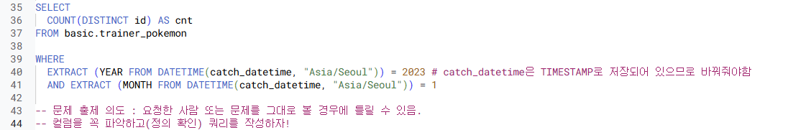

## 4-4. 날짜 및 시간 데이터 (2)
- CURRENT_DATETIME([time_zone]) : 현재 DATETIME 출력
    -  timezone을 "Asia/Seoul" 이런식으로 넣어줘야! 명시 안하면 결과에 시간 차이 생김

- DATETIME에서 특정 부분만 추출하고 싶은 경우 : EXTRACT 함수 
    

    - 요일을 추출하고 싶은 경우
        - EXTRACT(DAYOFWEEK FROM datetime_col) 
        한주의 첫날이 일요일이고, [1,7] 범위의 값을 반환 (일요일이면 1 반환)

- DATE와 HOUR만 남기고 싶은 경우 : 시간 자르기
    - DATETIME_TRUNC(datetime_col, HOUR) 
    ex. "2024-01-02 14:42:13"을 HOUR로 자르면 "2024-01-02 14:00:00
      
    -> 뭘 기준으로 자르는지에 따라 다름. day, year 같은 경우에는 EXTRACT를 더 많이 씀 (시간까지 00:00:00이렇게 나와있으면 쓸데없고 헷갈려서)

- 문자열로 저장된 DATETIME을 **DATETIME 타입**으로 바꾸고 싶은 경우 
    - PARSE_DATETIME('문자열의 형태', 'DATETIME 문자열') AS datetime
      
    약속 문자에 맞게 파싱함. 약속 문자는 외울 필요 없고 그때그때 찾자~

- DATETIME 타입 데이터를 특정 형태의 문자열 데이터로 변환하고 싶은 경우 
    - FORMAT_DATETIME("%c", DATETIME "2024-01-11 12:35:35") AS formatted;

> 문자열에서 DATETIME : PARSE_DATETIME  
    DATETIME에서 문자열 : FORMAT_DATETIME

- 마지막 날을 알고 싶은 경우: 자동으로 월의 마지막 값을 계산해서 특정 연산할 때
    - LAST_DAY(DATETIME) : 월의 마지막 값을 반환
      
    *WEEK = WEEK(SUNDAY) : 기본값이 일요일로 시작  
    주의 시작일을 바꾸고 싶다면 WEEK(MONDAY) 이런식으로 쓰기

- 두 DATETIME의 차이를 알고 싶은 경우 
    - DATETIME_DIFF(첫 DATETIME, 두번째 DATETIME, 궁금한 차이)
      
    *큰 값을 앞자리에 둬야 양수로 반환

 

- 정리
  
  
  
  

4-5, 4-6. 문제 풀이
- 1번
  
  

- 2번
  
  

- 3번
  

- 4번
  