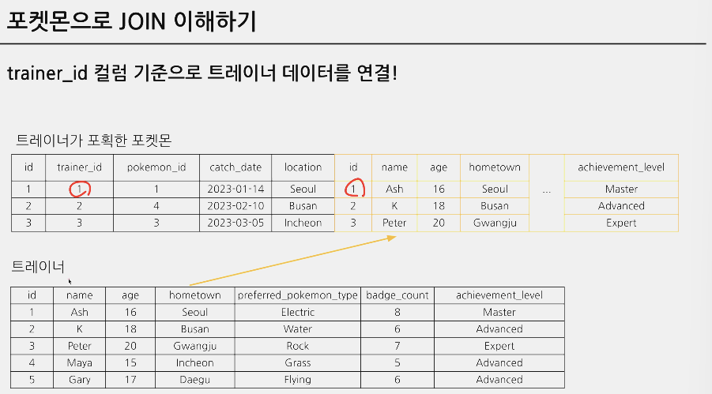
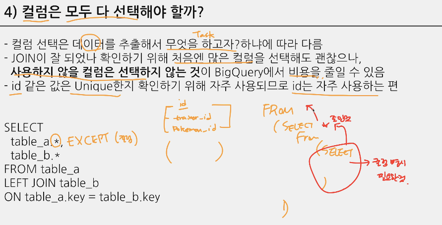

## 5-1. JOIN 시작~
- JOIN : 서로 다른 다량의 자료를 합치는 과정, 연결하는 과정
- 단일 테이블들을 연결해보자~

## 5-2. JOIN 이해하기
- 쿼리 작성 -> 결과 -> 확인(피드백) -> 다시 시도 -> 결과 무한반복하면 는다 ^_^

- 연결할 수 있는 테이블을 확인할 때는 보통 'ID' 확인해봄 (특정 범위(ex.Date)로 하기도 함)
    - 공통값(key)이 있어야 연결 가능
    - 다시 말해서 연결하기 전에 테이블 간의 공통값이 있는지 먼저 확인해봐야 함

  

  

- 조인한다는 건
    - 두 개의 테이블을 
    - 공통적으로 존재하는 컬럼 (KEY)를 기준으로 
    - KEY가 같은 row를 찾아서 
    - 기준 테이블에다가 조인하는 테이블을 우측에 붙이는 것
    - 즉 기준 테이블에 조인하는 테이블의 컬럼이 붙으면서 기준 테이블에 새로운 컬럼이 생기는 것이다

- 조인해야 하는 이유 - 데이터 저장되는 형태에 대한 이해
    - 관계형 데이터베이스(RDBMS) 설계 시 정규화 과정을 거침
        - 정규화는 중복을 최소화하기 위해 거침
    - 데이터 분석 관점에서는 미리 JOIN 되어있는게 좋을 수도 있지만, 개발 관점에서는 분리되어 있는게 좋음
    - 대신 데이터 웨어하우스에서 JOIN+필요한 연산을 해서 "데이터 마트"를 만들어서 활용

## 5-3. 다양한 JOIN 방법 (LEFT, RIGHT, INNER, CROSS JOIN)
  

  

- INNER : 공통적인 것만 가지고 옴
- LEFT : TABLE A를 먼저 가지고 온 상태에서 KEY 값 보면서 공통된 값만 씀 (없으면 NULL)
- RIGHT : TABLE B를 두고 먼저 가지고 온 상태에서 "
- FULL : KEY를 모두 다 입력하고, KEY 값 보면서 공통된 값만 씀 (없으면 NULL)

## 5-4. JOIN 쿼리 작성하기
- 작성 흐름
  

- SQL 문법
  

- 여러 JOIN별 쿼리 예시
    - INNER, LEFT/RIGHT, FULL은 구조 같음
      

- BigQuery에서 JOIN하기
    - 테이블에서 다 가지고 오고 싶으면: 테이블 약어(tp).*
    - JOIN한거에 또 JOIN 붙일 수 있음. 아래 사진에서 주황색 네모칸이 하나의 JOIN이고, 거기에다가 그 밑에 있는 LEFT JOIN을 한번 더 붙이는 것.
      

  

  

## 5-5. JOIN을 처음 공부할 때 헷갈렸던 부분
  

  
- 데이터 요소가 빠짐없이 존재하는가?가 중요
    - 전체 유저의 OO을 보고 싶은건지 주문한 유저들의 OO을 보고 싶은건지 -> 주문한 유저들의 OO가 보고 싶은거라면 Order Table 쓰면 됨. 반대로 주문 안한 유저들이 알고 싶은거라면 모든 user Table을 기준으로 하면 된다!

  

  

  

## 5-6. JOIN 연습 문제 1~5번
  

  

  

  

  

## 5-7. 정리
  