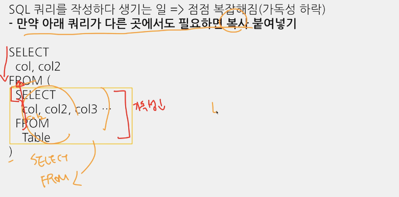

## 오늘 내용: 데이터를 어떻게 검증할 것인지

### 실수는 언제 발생하는가?
- 문법을 잘못 알고 있는 경우
- 데이터를 파악하지 않고 쿼리를 작성하는 경우
- 쿼리가 복잡한 경우 -> 쿼리를 쪼개야함

### 가독성을 챙기기 위한 SQL 스타일 가이드
1. 예약어는 대문자로 작성
    EX. SELECT, FROM, WHERE, 각종 함수
2. 컬럼 이름은 snake_case로 작성
    (회바회라서 camel case 써야될수도 있는데, 뭘 쓰든 일관성 중요)
3. 명시적 vs 암시적인 이름
    - Alias로 별칭 지을 때는 명시적인 이름 사용
    - AS a, AS b 같은건 쓰기 말기
    - JOIN할 때 테이블 이름도 명시적으로 할 수 있다면 명시적으로
    - AS를 쓰는 것 자체도 명시적(안 써도 별칭 설정 가능함), AS 쓰기
4. 왼쪽 정렬
    - 기본값으로 설정
5. 예약어나 컬럼은 한 줄에 하나씩 권장
    - 컬럼은 바로 주석처리할 수 있는 장점이 있으므로 한 줄에 하나씩 작성
6. 쉼표는 컬럼 바로 뒤에
SELECT
    col1,
    col2,
    col3, <- 이런식으로 컬럼 바로 뒤에 ,

### 가독성 챙길 때 WITH 구문 중요
WITH문은 SELECT보다 위에, 쿼리 최상위에 위치
  

  

- WITH 구문
    - CTE라고 표현
    - SELECT 구문에 이름 정해주는 것과 유사
    - 쿼리 내에서 반복적으로 사용 가능
      

- PARTITION
    - Table에 파티션이라는 것이 존재할 수도 있음 (없을수도)
    - 있다면 쓰는게 유용
    - 빅쿼리에서 데이터 탐색은 다 돈이다.. 파티션으로 데이터가 잘 나눠져있으면 데이터 탐색 적게 해도 됨
      

      

      

    - battle 테이블도 파티션 나눈 테이블이다! 세부 정보 보면 파티션 관련 정보도 알 수 있음. 이 페이지에서 새 쿼리 열면 파티션 쓸 수 있음!
      

    - 전체 데이터 가져오면 '실행 시 이 쿼리가 5.16KB를 처리합니다' 문구
      

    - ID만 가져오면 1.52KB로 바뀜
      

    - 파티션 쓸 때 WHERE 조건 같이 안 쓰면 오류 날수도 있음 (설정에 따라 다르다)

### 데이터 결과 검증
- 갑작스럽게 데이터 추출을 해야 되는 상황에서 데이터 결과 검증을 어떻게 할 수 있을까? (오류 ...)

- 데이터 결과 검증의 정의
    - SQL 쿼리 후 얻은 결과가 예상과 일치하는지 확인하는 과정
    - 목적: 분석 결과의 정확성, 신뢰성 확보
    - 방법
        - 내가 기대하는 예상 결과를 정의
        - 쿼리 작성
        - 두 개가 일치하는지 비교
    - 제일 중요한 부분
        - **문제를 잘 정의하고, 미리 작성**해보기
        - **도메인 특수성(규칙 등) 잘 파악**하기 
            - EX. 회사 정산 비율

  

  

  
1) 특정 user_id을 샘플로 두고 결과 확인해보고, 쿼리 결과가 동일한지 비교 확인 (샘플 1개에서 그치지 않고 3~4개 더 해보면 좋다)

  

2) 문법이 익숙하지 않을 때, 쉬운 데이터 만들어서 쿼리 자체가 올바른지 확인하기
- 사진 참고해서 예시 데이터 생성하면 된다

### 데이터 결과 검증 예시
  

  

  

  

- 여기서 생각해볼 점 : user_id가 7인 유저는 battle_cnt가 4일까?

  
- 데이터 테이블 다시 확인해보니까 player1_id뿐만 아니라 player2_id도 있음.player2로서 배틀한 횟수도 쳐야하기 때문에 앞에서 정한건 틀릴 수도 있다는거.

  

  

  
- player1_id, player2_id 둘다 있는게 이슈가 될 수 있음..

  
- 그래서 player1, 2 구분 필요없는 통합 데이터를 만든다!

  

  
- CASE WHEN 사용

  