### 1번

(1) 트레이너가 보유한 포켓몬의 평균 레벨, 포켓몬의 수
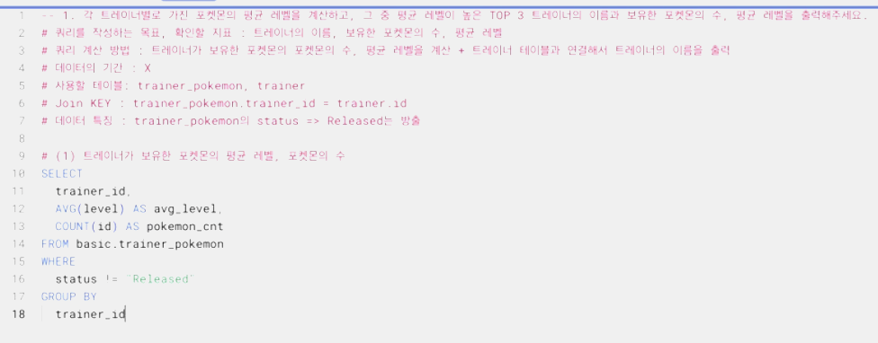  

(2): (1)에서 만든 테이블 + trainer 테이블을 합쳐서 trainer의 name 출력
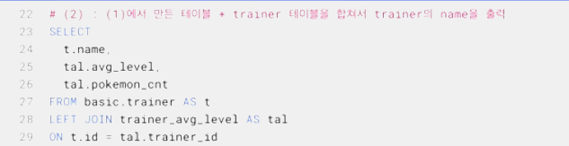  

- 만약 trainer 테이블에 중복이 있다면? -> select 다음에 distinct 붙이거나, group by 사용

### 2번

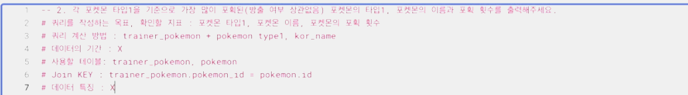  

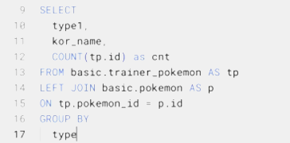  

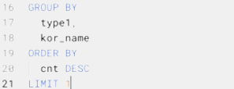  

### 3번
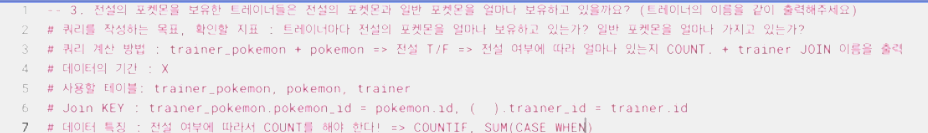  

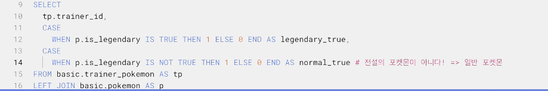  

### 4번
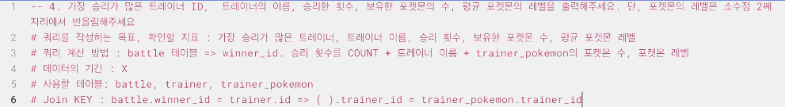  

- (1) winner_id, COUNT(승리 횟수)
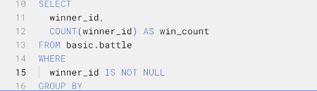  

- (2) 이름을 추가
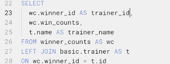  

- 가장 승리가 많은, 관점으로는
    - 이름을 추가한 결과에서 필터링해서 가장 승리가 많은 trainer_id 1개만 뽑을 수도 있음
    - 평균 포켓몬 레벨, 포켓몬 수 추가한 후에 trainer_id 1개만 뽑을 수 있음
    - 둘다 가능한 방법, but 데이터가 많다면 첫번째 방법 추천

- (3) 평균 포켓몬 레벨, 포켓몬 수 추가
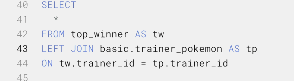  

### 5번
- (1) 트레이너가 보유한 포켓몬들의 attack, defense
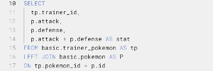  

- 테이블 2개 합치고 싶을 땐 [테이블1] + [테이블2] -> 이렇게 '+' 쓰면 됨

### 6번
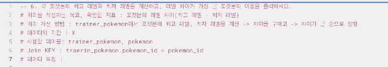  
* 데이터 특징 일단 없음

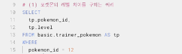  
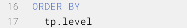  
- pokemon_id => min level이 6, max level이 22, level_difference가 16
- min level은 'MIN' 함수로
- max level은 'MAX' 함수로